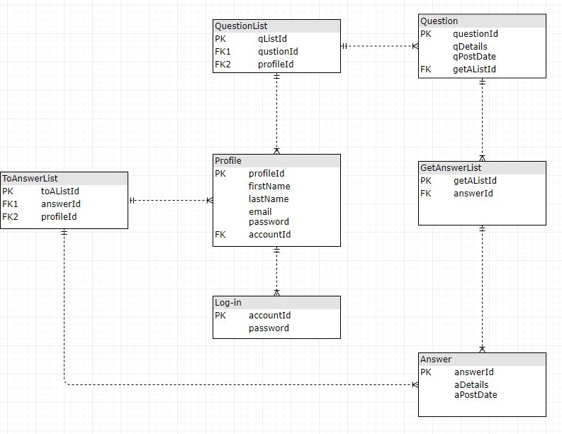
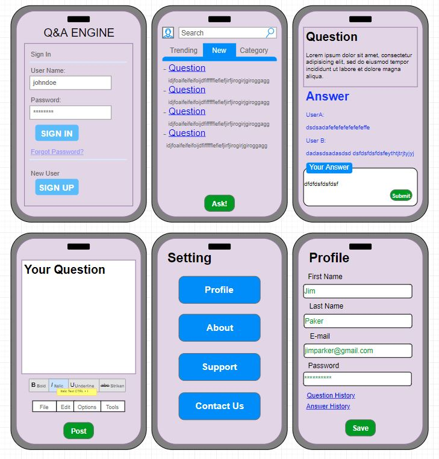

The project is hosted on https://qa-engine.netlify.com/
The database repo is on https://github.com/liangjinhongwin/qa-engine-api

# Passion Project - Question & Answer Engine

### About

This is my passion project that users can post their questions then other users can provide their answers. In the end, the original user of the question is able to pick the best answer.

### Functional and Non-functional Requirements
- Functional Requirements
  - User should be able to create an account to log in
  - User should be able to add questions and answers to questions
  - User should be able to pick the best answer to own question
  - Store the data somewhere
  
- Non-functional Requirements
  - Capacity: A website should be capable enough to handle numbers of users without affecting its performance
  - Security: operation and use of safety requirements related to access control and private data processing
  - Usability: ease of use and user-friendly interface
  
### Features
 - Must to have:
   - Log-in
   - Adding questions
   - Adding answers to questions
   - Picking the best answer by the original user
   - Historical data
   
 - Nice to have:
   - Similar questions that added earlier
   - Motivation System
   
### Entity Relationship Diagram

### Prototype

