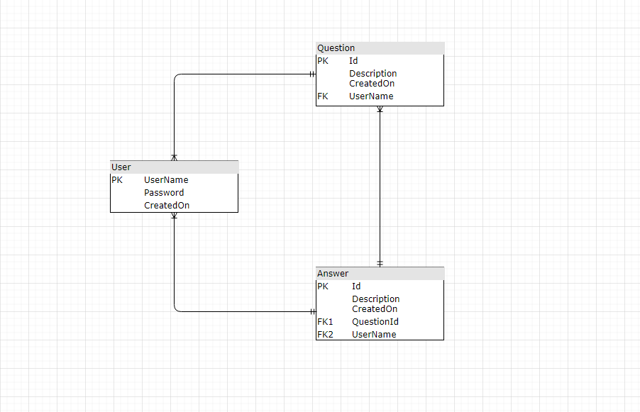
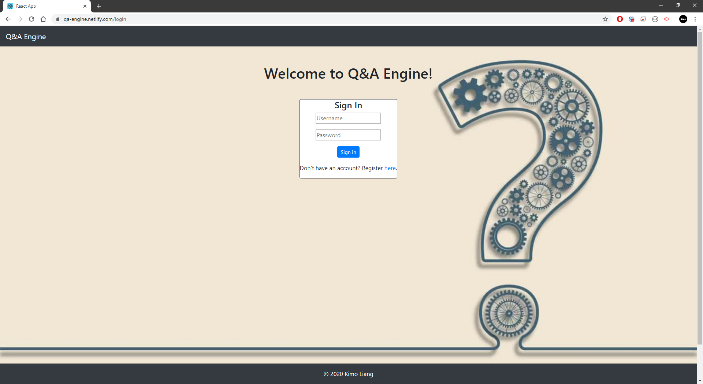
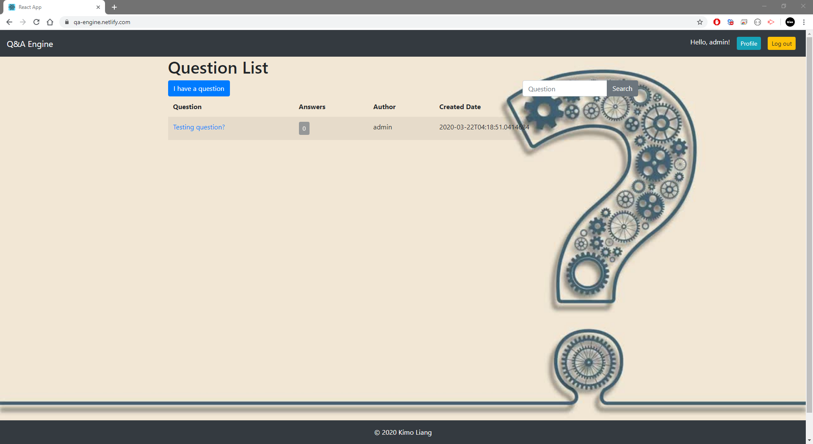
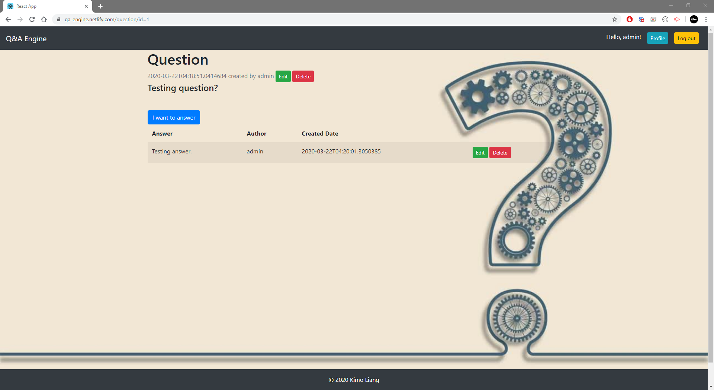
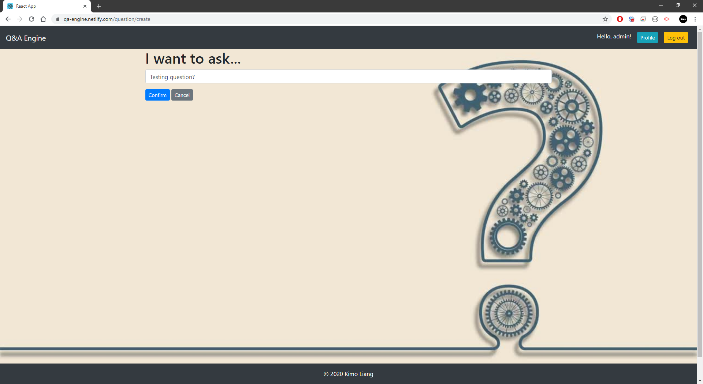
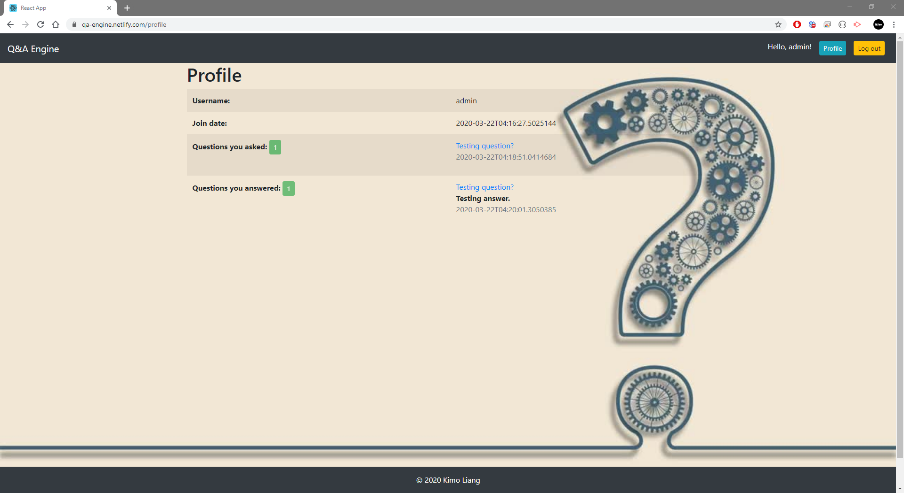

The project is hosted on https://qa-engine.netlify.com  
The database repo is on https://github.com/liangjinhongwin/qa-engine-api/tree/branck-kimo 
The video tour is on https://youtu.be/qd6TCrX_Iq0  

# Passion Project - Question & Answer Engine

### About
This is my passion project that users can post their questions then other users can provide their answers.

### Functional and Non-functional Requirements
- Functional Requirements
  - User should be able to create an account to log in
  - User should be able to add questions and answers to questions
  - User should be able to search questions
  - Store the data somewhere
  
- Non-functional Requirements
  - Capacity: A website should be capable enough to handle numbers of users without affecting its performance
  - Security: operation and use of safety requirements related to access control and private data processing
  - Usability: ease of use and user-friendly interface
  
### Features
 - Must to have:
   - Log-in
   - Adding questions
   - Adding answers to questions
   - Historical data
   
 - Nice to have:
   - Similar questions that added earlier
   - Motivation System
   
### Entity Relationship Diagram

### Prototype
 - Mobile
   - 

 - Web
   - Login page
     - 
   - Main page
     - 
   - Detail page
     - 
   - Add page
     - 
   - Profile page
     - 
   - Search page
     - 